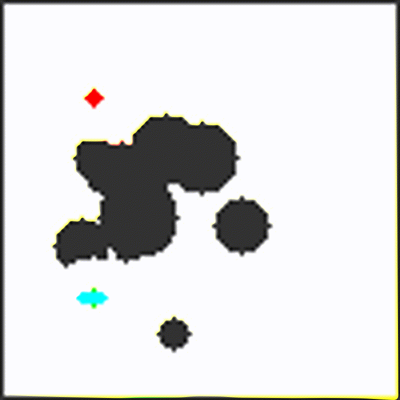

# Maze Navigation with Bicycle Model Robot



## Design Approach

### 1. Class Structure

#### BicycleModel Class
- **Continuous State**: `x, y, theta, steering_angle` (floats for precise dynamics)
- **Discretized State**: `grid_x, grid_y, theta_bin, steering_bin` (integers for efficient search)
- **Key Method**: `Move(delta_steering)` - applies bicycle dynamics and returns new state
- **Features**: State validation, unique key generation, distance calculation

#### Maze Class  
- **Random Obstacle Generation**: 30% density with border walls
- **Heuristic Map**: Pre-computed distance map using Dijkstra's algorithm
- **Best Node Storage**: Hash map storing optimal nodes for each discretized state
- **State Management**: Validates robot positions and tracks goal conditions

#### AStarOptimizer Class
- **Search Algorithm**: Hybrid A* with bicycle model constraints
- **State Expansion**: 3 discretized steering control inputs
- **Termination**: Goal reached or iteration limit exceeded

### 2. Maze Generation
- **Algorithm**: Random obstacle placement with guaranteed connectivity
- **Structure**: 100x100 grid where each cell represents 1m x 1m  
- **Obstacle Spawning**: Spawning n obstacles with random radius in the space
- **Start/Goal**: Randomly placed with minimum separation distance

### 3. Robot Model
- **Type**: Bicycle model with kinematic constraints
- **Parameters**:
  - Wheelbase: 3.32m
  - Center of Gravity: Middle of wheelbase
  - Maximum steering angle: 35°
  - Maximum steering rate: 25°/s
  - Operating speed: 1.0 m/s (constant)

### 4. Bicycle Model Dynamics
- **Continuous Integration**: Precise floating-point state evolution
- **Slip Angle Calculation**: `β = atan(0.5 * tan(δ))` for realistic motion
- **State Update**:
  ```
  x_new = x + v * cos(θ + β) * dt
  y_new = y + v * sin(θ + β) * dt  
  θ_new = θ + (v/L) * tan(δ) * cos(β) * dt
  ```
- **Constraints**: Steering angle ±35°, rate limit 25°/s
- **Discretization**: 20 orientation bins, 11 steering bins

### 5. Hybrid A* Search Strategy
- **State Space**: 4 Dimensional (x, y, theta, steering)
- **Heuristic**: Pre-computed optimal distance map without considering motion constraints (accounts for obstacles)
- **Node Management**: Hash map with state keys for efficient lookup
- **Expansion**: 3 delta steering [-25°, 0°, 25°]
- **Termination**: Goal cell reached or iteration limit (200,000)

### 6. Visualization System
- **Framework**: OpenCV for rendering and image processing
- **Output**: Series of PNG frames showing robot movement, frame by frame
- **Animation**: Step-by-step visualization of planned path execution
- **Elements**:
  - Black: Walls or Obstacles
  - White: Free space
  - Green circle: Start position
  - Red circle: Goal position
  - Yellow line: Robot trajectory
  - Cyan Arrow: Robot position

## System Requirements

### Dependencies
- **C++14** or later compiler
- **OpenCV**
- **FFmpeg** (optional, for GIF generation)

## Compilation Steps

### Option 1: Using CMake (Recommended)

1. **Create Build Directory**:
   ```bash
   mkdir build
   ```

2. **Build**:
   ```bash
   cd build
   cmake ..
   cmake --build .
   ```

### Option 2: Direct Compilation   
command:
```bash
g++ -std=c++14 -O2 main.cpp -o planner -I<path/to/opencv_include> -L/path/to/opencv_lib -lopencv_core -lopencv_highgui -lopencv_imgcodecs -lopencv_imgproc`
```

example
```bash
g++ -std=c++17 -O2 main.cpp -o planner -I/usr/local/include/opencv4 -L/usr/local/lib/opencv4 -lopencv_core -lopencv_highgui -lopencv_imgcodecs -lopencv_imgproc`
```
## Execute the Unit Tests (Optional)
The utils tests executable will be generated in the build directory.

```bash
./utils_test
```

For now, only the Utility Function Tests are implemented.

## Execute the Program

You may choose to use pure Diskstra search or Hybrid A* optimizer (recommended).
### Basic Execution
```bash
./planner <0 for Hybrid A*, 1 for Diskstra> <Environment Seed (unsigned int)>
```

example
```bash
./planner 0 42
```

### Expected Output
```
=== Improved Maze Navigation with Bicycle Model Robot ===

1. Generating maze with circular obstacles...
Maze generated with 9 circular obstacles
Start: (40, 72)
Goal: (84, 25)
DT: 1.414 seconds
Theta bins: 20 (18° per bin)
Initial state: (40.5, 72.5, 360°)

2. Starting A* search with arc length cost...
Path found after 91 iterations!
Path cost: 66.6012
Search completed in 0 ms

3. Creating visualization...
Saved 49 simulation frames.

```

The images will be saved in the directory where the program is executed.

### Generating GIF Animation (optional)
```bash
# Install FFmpeg if not available
sudo apt install ffmpeg  # Ubuntu

# Convert frames to GIF
ffmpeg -framerate 10 -i simulation_%d.png -vf "scale=800:800" -y maze_animation.gif
```
## Troubleshooting

### Issues
1. **Compilation Errors**:
   - Ensure C++14 support
   - Check OpenCV installation: `pkg-config --modversion opencv4`

2. **No Path Found**:
   - Maze generation is random; some configurations may be challenging or infeasible
   - Increase search space limit or adjust robot parameters
